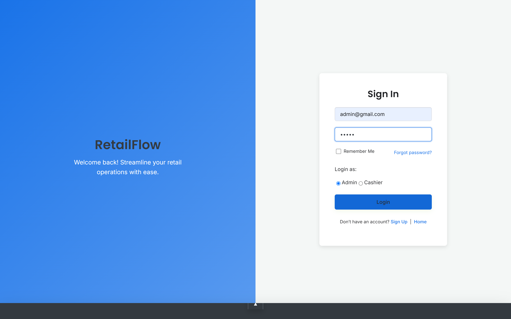
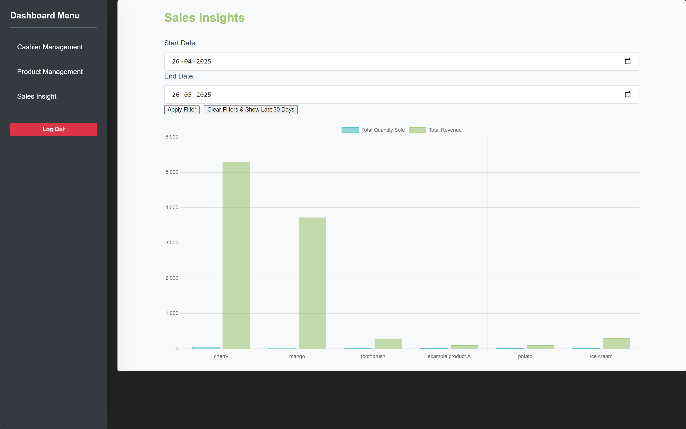
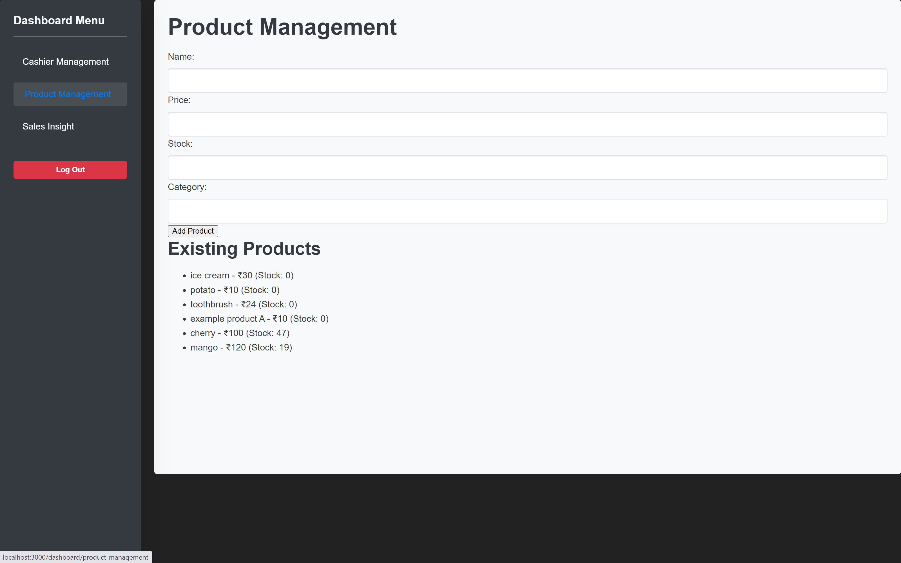

# Retail Automation Platform

A comprehensive web-based platform designed to streamline retail operations, manage sales, inventory, and user roles within a retail environment. This platform aims to provide an efficient and user-friendly solution for small to medium-sized retail businesses.

---

## Table of Contents

- [About](#about)
- [Features](#features)
- [Tech Stack](#tech-stack)
- [Project Structure](#project-structure)
- [Installation](#installation)
- [Usage](#usage)
- [Configuration](#configuration)
- [API Reference](#api-reference)
- [Screenshots](#screenshots)
- [Contributing](#contributing)
- [Roadmap](#roadmap)
- [License](#license)
- [Authors](#authors)
- [Acknowledgments](#acknowledgments)

---

## About

The Retail Automation Platform is a full-stack web application built to modernize and simplify the day-to-day operations of a retail store. It offers distinct functionalities for different user roles (Administrators and Cashiers), covering aspects from inventory management to sales processing and user administration.

- **What does it do?** It allows administrators to manage products, view stock, oversee sales transactions, and manage cashier accounts. Cashiers can process sales, generate bills, and view product information.
- **Why did you build it?** To create an integrated system that enhances operational efficiency, improves inventory accuracy, provides insights into sales data, and offers a better user experience for retail staff.
- **What makes it unique?** (User can add specific unique selling points here, e.g., "Its intuitive role-based interface and real-time sales tracking capabilities...")

## Features

- **User Authentication:** Secure signup for administrators and login for all users (Admin, Cashier).
- **Role-Based Access Control:**
    - **Admin Dashboard:** Centralized control panel for managing products, inventory, sales insights, transactions, and cashier accounts.
    - **Cashier Dashboard:** Interface for processing sales, printing bills, and viewing product stock.
- **Product Management (Admin):** Add new products, view existing products, update product details, and remove products from the catalog.
- **Inventory Management (Admin & Cashier):** View current stock levels of products.
- **Sales Processing (Cashier):** Perform purchases, calculate totals, and generate printable bills.
- **Transaction Management (Admin):** View a comprehensive history of all sales transactions.
- **Sales Insights (Admin):** Visualizations and reports on sales performance (feature to be expanded).
- **Cashier Management (Admin):** Add, view, and manage cashier user accounts.
- **Password Recovery:** "Forgot Password" functionality for users.

## Tech Stack

- **Frontend:**
    - React.js (with Hooks and Context API for state management)
    - React Router for navigation
    - CSS3 (with custom styling and potentially CSS variables for theming)
    - Axios for API communication
- **Backend:**
    - Node.js
    - Express.js framework
    - MySQL (or a compatible SQL database, as indicated by `schema.sql`)
    - RESTful APIs
    - JWT (JSON Web Tokens) for authentication
- **Database:**
    - MySQL (based on `schema.sql` and typical `db.js` setups)
- **Development Tools:**
    - npm for package management
    - Git & GitHub for version control

## Project Structure

The project is organized into a client-side (React app) and a server-side (Node.js/Express backend) structure.

```
Retail-Automation-Platform/
├── package.json        # Frontend and global project scripts
├── README.md           # This file
├── public/             # Static assets for the React app (index.html, manifest, etc.)
├── server/
│   └── signup-backend/ # Backend application
│       ├── auth.js             # Authentication routes (signup, login)
│       ├── cashiers.js         # Cashier management routes
│       ├── db.js               # Database connection logic
│       ├── package.json        # Backend dependencies
│       ├── products.js         # Product management routes
│       ├── sales.js            # Sales processing routes
│       ├── schema.sql          # Database schema definition
│       ├── server.js           # Main backend server file
│       ├── transactions.js     # Transaction viewing routes
│       └── middleware/
│           ├── authMiddleware.js   # JWT authentication middleware
│           └── roleMiddleware.js   # Role-based access control middleware
└── src/                  # Frontend React application source code
    ├── App.jsx             # Main application component
    ├── index.jsx           # Entry point for the React app
    ├── component/          # UI components (Login, SignUp, Dashboards, etc.)
    ├── hoc/                # Higher-Order Components (e.g., RequireAuth)
    ├── routes/             # Routing configuration (e.g., ProtectedRoute)
    └── styles/             # Global styles and themes
```

## Installation

Follow these steps to set up the project locally:

**Prerequisites:**
- Node.js and npm (Node Package Manager) installed.
- MySQL server installed and running.

**1. Clone the Repository:**
```bash
git clone https://github.com/yourusername/Retail-Automation-Platform.git # Replace with your actual repo URL
cd Retail-Automation-Platform
```

**2. Setup Backend:**
```bash
cd server/signup-backend
npm install
```
   - **Database Setup:**
     1. Create a MySQL database (e.g., `retail_platform_db`).
     2. Configure your database connection details in `server/signup-backend/db.js`.
        You might need to update host, user, password, and database name.
        Example `db.js` (ensure it matches your actual file):
        ```javascript
        // server/signup-backend/db.js
        const mysql = require('mysql2');
        const pool = mysql.createPool({
          host: 'localhost',      // Or your DB host
          user: 'your_db_user',   // Your MySQL username
          password: 'your_db_password', // Your MySQL password
          database: 'retail_platform_db', // The database you created
          waitForConnections: true,
          connectionLimit: 10,
          queueLimit: 0
        });
        module.exports = pool.promise();
        ```
     3. Import the database schema using the `schema.sql` file. You can use a MySQL client (like MySQL Workbench, DBeaver, or the command line) to execute the SQL commands in `server/signup-backend/schema.sql`.
        Example using MySQL CLI:
        ```bash
        mysql -u your_db_user -p your_retail_platform_db < schema.sql
        ```

**3. Setup Frontend:**
```bash
cd ../../ # Navigate back to the project root directory
npm install
```

## Usage

**1. Start the Backend Server:**
```bash
cd server/signup-backend
npm start
```
   - The backend server will typically run on `http://localhost:5000` (or as configured in `server.js`).

**2. Start the Frontend Development Server:**
   Open a new terminal window/tab.
```bash
cd Retail-Automation-Platform # (If not already in the root directory)
npm start
```
   - The React development server will typically run on `http://localhost:3000` and open automatically in your default web browser.

You can now access the application by navigating to `http://localhost:3000`.

## Configuration

- **Backend Database:** Connection details for the MySQL database need to be configured in `server/signup-backend/db.js` as shown in the Installation section.
- **API Port:** The backend API port can be changed in `server/signup-backend/server.js` (default is usually 5000).
- **Frontend Port:** The React app's development port can sometimes be configured in `package.json` scripts or via environment variables if needed, but `npm start` usually defaults to 3000.
- **Environment Variables:** If you plan to use `.env` files for sensitive data (like database credentials or JWT secrets), ensure they are documented here and added to `.gitignore`.
  Example for backend (`server/signup-backend/.env`):
  ```
  DB_HOST=localhost
  DB_USER=your_user
  DB_PASSWORD=your_password
  DB_NAME=retail_platform_db
  JWT_SECRET=yourSuperSecretKeyForJWT
  ```
  And update `db.js` and `authMiddleware.js` to use these environment variables (e.g., using `dotenv` package).

## API Reference

The backend exposes RESTful APIs for various functionalities. All API routes are prefixed with `/api`.

**Authentication (`/api/auth`)**
- `POST /signup`: Admin user registration.
  - **Request Body:** `{ "name": "Admin User", "email": "admin@example.com", "password": "securepassword123", "role": "admin" }`
  - **Response:** Success message or error.
- `POST /login`: User login (Admin/Cashier).
  - **Request Body:** `{ "email": "user@example.com", "password": "password123", "role": "admin/cashier" }`
  - **Response:** `{ "token": "jwt_token", "role": "user_role", "userId": "user_id" }` or error.

**Products (`/api/products`)** (Protected, Admin access for CUD operations)
- `GET /`: Get all products.
- `GET /:id`: Get a single product by ID.
- `POST /`: Add a new product (Admin only).
  - **Request Body:** `{ "name": "Product Name", "description": "...", "price": 19.99, "stock_quantity": 100, "category_id": 1 }`
- `PUT /:id`: Update an existing product (Admin only).
- `DELETE /:id`: Delete a product (Admin only).

**Sales (`/api/sales`)** (Protected)
- `POST /`: Create a new sale transaction (Cashier/Admin).
  - **Request Body:** `{ "userId": 1, "totalAmount": 150.75, "items": [{ "productId": 1, "quantity": 2, "priceAtSale": 25.00 }, ...] }`
- `GET /`: Get all sales transactions (Admin only).
- `GET /:id`: Get details of a specific sale (Admin only).

**Cashiers (`/api/cashiers`)** (Protected, Admin access)
- `POST /`: Add a new cashier.
  - **Request Body:** `{ "name": "Cashier Name", "email": "cashier@example.com", "password": "password123", "role": "cashier" }`
- `GET /`: Get all cashiers.
- `PUT /:id`: Update cashier details.
- `DELETE /:id`: Delete a cashier.

**Transactions (`/api/transactions`)** (Protected, Admin access)
- `GET /`: Get all transaction records (likely similar to GET /api/sales, or more detailed).

*(Note: This is a summary. Actual request/response bodies and parameters might vary. Refer to backend route definitions in `server/signup-backend/*.js` for precise details. Ensure JWT token is sent in `Authorization` header for protected routes: `Authorization: Bearer <token>`)*

## Screenshots






## Contributing

Contributions are welcome! If you'd like to contribute to the project, please follow these steps:

1.  **Fork the repository.**
2.  **Create a new branch** for your feature or bug fix:
    ```bash
    git checkout -b feature/your-feature-name
    ```
3.  **Make your changes** and commit them with clear, descriptive messages.
4.  **Push your changes** to your forked repository:
    ```bash
    git push origin feature/your-feature-name
    ```
5.  **Submit a Pull Request** to the main repository's `main` or `develop` branch.

Please ensure your code adheres to the existing coding style and includes tests if applicable.

## Roadmap

- [ ] **Advanced Sales Analytics:** More detailed charts and reports for sales trends, top-selling products, etc.
- [ ] **Supplier Management:** Module for managing suppliers and procurement.
- [ ] **Customer Management:** Basic CRM features for tracking customer purchase history.
- [ ] **Low Stock Alerts:** Notifications for products running low on inventory.
- [ ] **Barcode Scanner Integration:** For faster sales processing.
- [ ] **Enhanced UI/UX:** Continuous improvements to the user interface and experience.
- [ ] **Automated Testing:** Implement more comprehensive unit and integration tests for frontend and backend.

## License

This project is licensed under the MIT License. See the `LICENSE` file for more details.

## Authors

- **Sawan Bhardwaj** - *Initial work & Lead Developer* - (https://github.com/sawanb22)

## Acknowledgments

- Hat tip to anyone whose code was used.
- Inspiration.
- etc.

---